# Understanding Output

TinkerBench produces three types of artifacts. They are:

- Console
- Logging
- Grafana Dashboard

## Console

Console output is always produced.

### Stages 1 to 3

Below shows the normal output produced for stages 1 to 3 of a run. This output shows the arguments provided and the default values. If [Prometheus](https://prometheus.io/) is enabled (enabled in this example) and/or Logging is enabled (enabled in this example). If Prometheus and/or Logging was disabled, no output would be present.

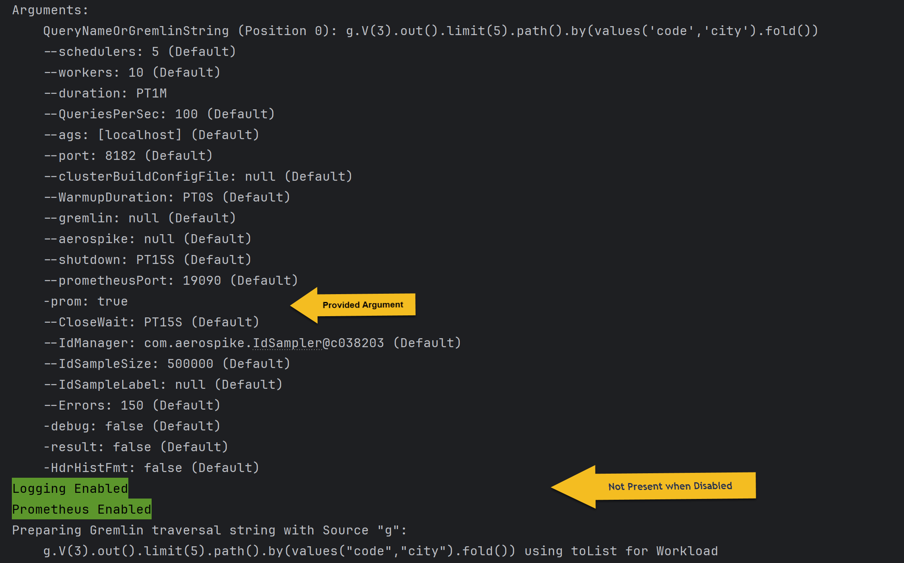

### Stage 4 (Workload Run Phase)

The console will display the pre and post phases plus a “ticker” showing query iteration progression.

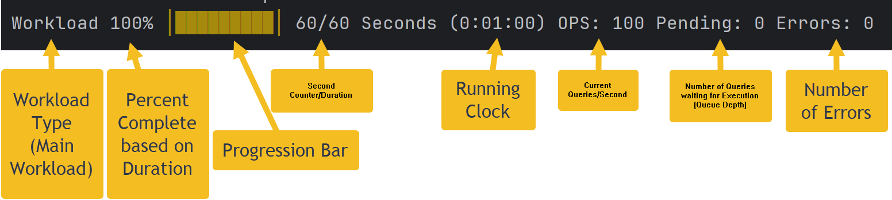

This ticker shows the following runtime information:

- Workload Type -- Warmup or Workload (Main)
- Percent completed based on the query duration
- Ticking progression bar
- The number of seconds elapsed and the provided duration
- Running clock
- Current Query Per Second
- Pending number of queries waiting for execution (Queue Depth). For more information see [tuning](./tuning.md) section.
- Number of encountered errors

### Stage 5 (Postprocessing/Cleanup)

The console will typically show the following output.

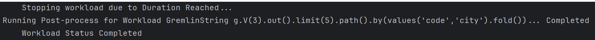

Note that there could be different reasons why the workload was stopped (terminated). They are:

- Duration Reached – The workload duration was reached, stopping the execution normally.
- Due to Signaled – TinkerBench was interrupted by a kill, Ctrl/Command-C, etc. Below is an example of the display.
    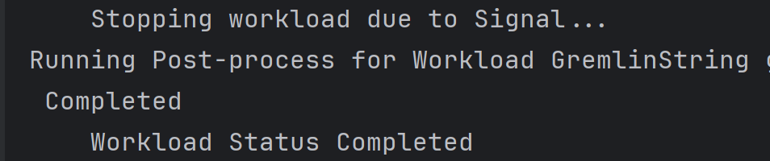

|  | A Ctrl/Command-C will cause TinkerBench to terminal query execution. All Summary Reports will still be produced. In this manner, you can stop long running executions but still receive the reports. |
|------------------------------------------------------------------------------------------------------|-------------------------------------------------------------------------------------------------------------------------------------------------------------------------------------------------------|

- Due to Error – The maximum number of errors was reached, or a fatal error was encountered resulting in termination.
- Due to Timeout – Query execution progression was not being made based on the Gremlin timeout and execution was terminated.

In any abnormal termination, Stage 6 (Report Results) will always be run providing any results up to the termination.

### Stage 6 (Report Result)

This stage produces the results of the query execution. This report is brekon down to the following reports:

- 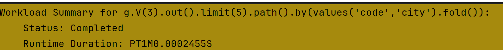Overview
    - Runtime duration, which should match the duration provided.
- Successful Completed Queries
    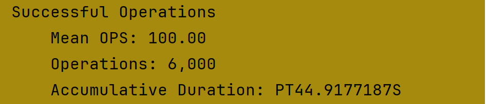
    - Mean QPS Rate – The average query rate over the execution duration.
    - Total number of queries
    - Accumulated Duration – The actual amount of time spent to run all queries without any worker or scheduler overhead.
- Queries in Error
    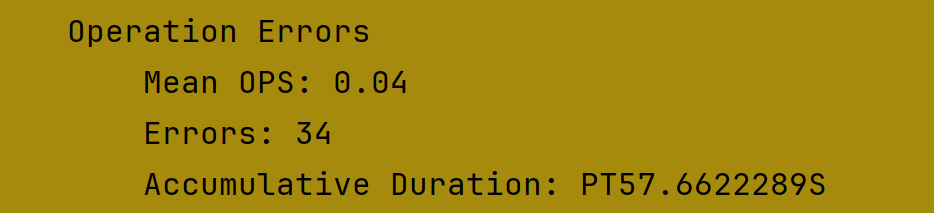
    - Average Error Rate
    - Number of Errors
    - Accumulated Duration – The amount of time spent handling the error.
- Summary
    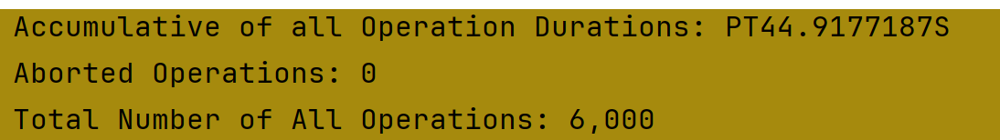
- Client Query Queue Depth
    This section provides insight into TinkerBench query performance. For more information see [tuning](./tuning.md) section.
    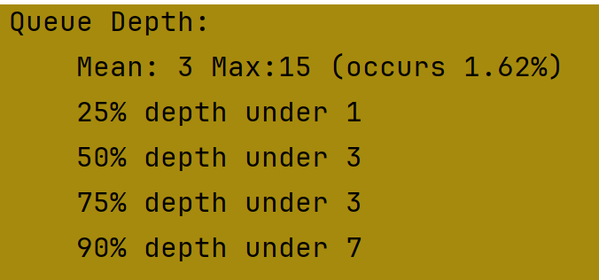
    - The queue’s average and maximum queue depth. The percentage next to the maximum indicates how many times TinkerBench hit the maximum depth.
    - The percentage breakdown indicates the distribution of percentage at that queue depth. For example:
        - 25% depth under 1 – 25% of the time the queue depth was under 1.
        - 50% depth under 3 – 50% of the time the queue depth was under 3. This includes the 25% depth.
- Error Details
    If any error occurred during query execution, an “Error summary” report will be presented. It will show a summary description and the number of occurrences of this error. It is not meant for detail debugging. That can only be provided by enabled logging, see the [Logging](./understanding_output.md#logging) section for details.
    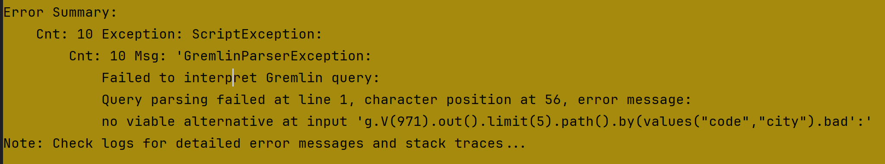
- Latency Percentile
    This will provide the latency information using the actual query latency value without any overhead of the worker or scheduler. The latency is captured at the nanosecond but presented in milliseconds. TinkerBench uses the [HdrHistogram](https://github.com/HdrHistogram/HdrHistogram) package for all the recording and analyzing of this data. There are two forms of the latency report.
    - Summary Report
        This report is the default and provides a subset of the complete HdrHistogram report. This report contains the latency percentiles, average, maximum, and deviation.
        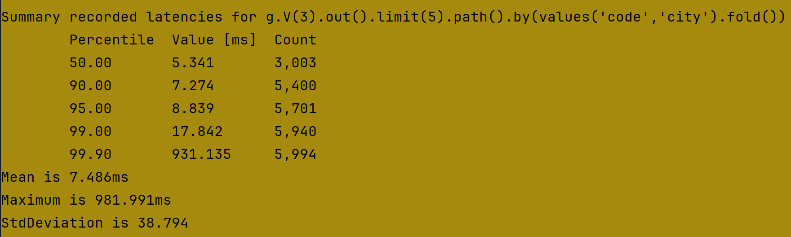
    - Full Report
        This report is produced if the `--HdrHistFmt` flag is provided. It produces a complete HdrHistogram report that can be consumed by the [HdrHistogram Plotter](https://hdrhistogram.github.io/HdrHistogram/plotFiles.html).
        **Note**: If logging is enabled, the full HdrHistogram reported is always rendered in the log.
        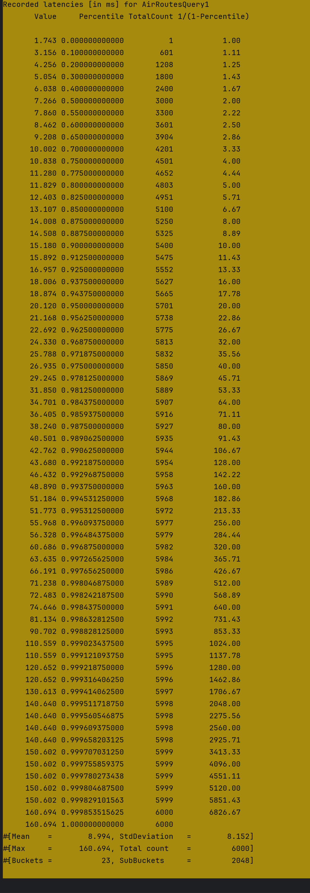
        - Value column is the latency in milliseconds for that percentile.
        - The percentile column is the percentage that latency is at or better.
        - The count column is the number of queries that make up that percentile.
        - The “1/(1-Percentile)” (Inverse percentiles) column focus to the proportion of requests meeting specific performance targets.

### Typical Complete Console Output

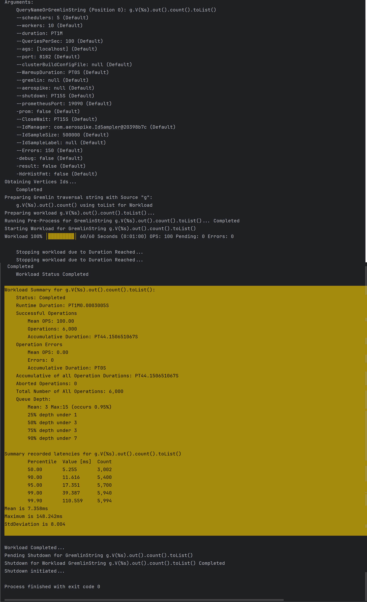

## Logging

Logging is disabled by default. Logging can be enabled by updating the [logback.xml](https://logback.qos.ch/) file. Below is the logback file provided by TinkerBench.

```xml
<configuration>
    <!--appender name="FILE" class="ch.qos.logback.core.FileAppender">
        <file>logs/TinkerBench.log</file>
        <encoder>
            <pattern>%d{yyyy-MM-dd HH:mm:ss.SSS} [%thread] %-5level %logger{36} - %msg%n</pattern>
        </encoder>
    </appender-->
    <logger name="com.aerospike.TinkerBench" level="OFF"/>
    <logger name="io.opentelemetry.javaagent.slf4j.simpleLogger.defaultLogLevel" level="OFF"/>
    <!--logger name="com.aerospike.TinkerBench" level="info" additivity="false">
        <appender-ref ref="FILE"/>
    </logger-->
    <!--root level="info">
        <appender-ref ref="FILE"/>
    </root-->
</configuration>
```

This file can be found in the TinkerBench jar or in [GitHub](../src/test/java/loopback.xml).

### Enable File Logging

To enable simple file logging using the provided logback file, just uncomment the “appender” tag and “logger” tag with the “appender-ref” tab. Comment out the original “logger” tab. This will enable a logging file named “TinkerBench.log” under the folder “logs”. Below is an example enabling logging.

```xml
<configuration>
    <appender name="FILE" class="ch.qos.logback.core.FileAppender">
        <file>logs/TinkerBench.log</file>
        <encoder>
            <pattern>%d{yyyy-MM-dd HH:mm:ss.SSS} [%thread] %-5level %logger{36} - %msg%n</pattern>
        </encoder>
    </appender>
    <logger name="io.opentelemetry.javaagent.slf4j.simpleLogger.defaultLogLevel" level="OFF"/>
    <logger name="com.aerospike.TinkerBench" level="info" additivity="false">
        <appender-ref ref="FILE"/>
    </logger>
    <!--root level="info">
        <appender-ref ref="FILE"/>
    </root-->
</configuration>
```

The new logback file needs to be placed in the Java class path (i.e., logback.xml) or you can use the Java runtime command-line system property option for a different location or name. Below is an example:

```bash
java -Dlogback.configurationFile=.\mylogback.xml tinkerbench-*.jar
```

### Other Configurations

TinkerBench uses [Simple Logging Facade package](https://www.slf4j.org/) and can be configured to used different logging providers and configuration options. This advance logging configuration is outside the scope of this documentation.

### Typical Logging File Format

The default logging in TinkerBench provides all the same information as displayed on the [Console](./console.md) except it always produces the full HdrHistogram report.

Below is a typical example of the logs:

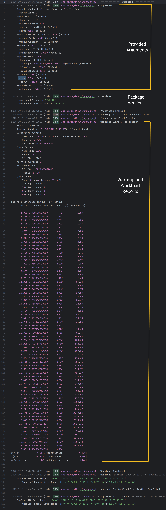

### Logging Errors

All errors during execution will be fully logged. This provides the most detail around an error. This behavior is different as compared to how errors are [displayed in the console](#understanding-errors). Below is an example of how errors are logged:

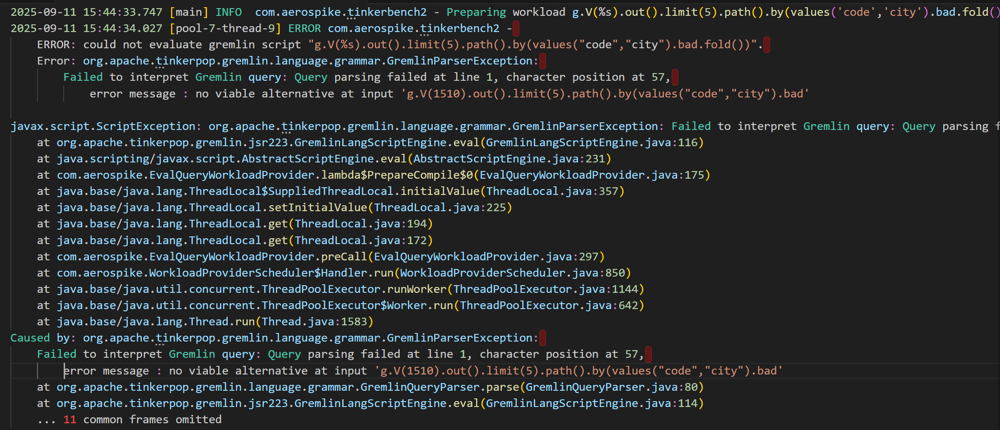

|  | If `-debug` flag is provided, all tracing and debug messages are also captured in the log file. |
|------------------------------------------------------------------------------------------------------|-------------------------------------------------------------------------------------------------|

## Grafana Timestamps

Timestamp ranges are written to the console and log. These time ranges are produced at the end of the workload phase and upon application completion.

They can also be copied and pased into any Grafana dashboard. For more information see this [section](./grafana_dashboard.md#using-the-grafana-timestamps)

Below ia an example:

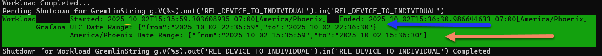
