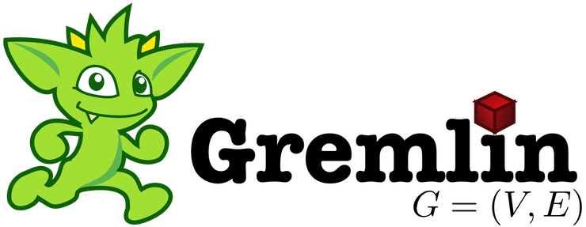

# Understanding Workload and Runtime Stages

TinkerBench has two workload run types. They are:

- Warmup – Conducted if the warmup duration (`--WarmupDuration`) is defined. This executes the query like “workload” for the purpose of “warming up” the database. Meeting the targeted QPS rate may or may not occur. Summary results are captured and reported. This run is not required.
- Workload – This preforms the “**main”** workload and strides to make and maintain the QPS rate for the duration of the run. Results are captured and reported based on the configuration provided.

When TinkerBench executes it goes through the following stages:

1. Initialization Performs checks of the configurations, prepares and connections to the database, etc.
2. Vertex Id retrieval, if required Obtains vertex ids, if required by the query. These ids are randomly selected for each execution of the query.
3. Preparing and Completion of the Gremlin Query String, if required If a Gremlin query string is provided, the string is prepared and compiled into bytecode for repeated executing during workload run phase.
4. Workload Run Phase (i.e., run Warmup and/or Main Workload) For each workload run type the following phases are executed:
    1. Preprocessing The workload scheduler is prepared to execute the query
    2. Start
    3. Iteration This phase is run until the duration is obtains. The scheduler adjusts the workers to obtain the QPS rate based on the provided configuration.
    4. Postprocessing This phase performs result collection, cleanup, etc.
    5. Shutdown
5. TinkerBench Cleanup
6. Report Results This stage will display the results based on the configuration provided.

## Using QPS Sweep

TinkerBench has the capabilities to run a range of rates starting at the `--QueriesPerSec` and ending at the `--EndQueriesPerSec` (non-zero value). Each segment is ran for the defined duration. Once completed, the current rate is incremented by `--IncrementQueriesPerSec`.

### Run until the End QPS is Reached

If `--EndQueriesPerSec` is non-zero, TinkerBench wil run until the defined rate is reached regardless if the QPS was maintained. If a fatal exception/error is encountered or the run was canceled, TinkerBench will end with a non-zero return code.

### Run until QPS Failure

If `--EndQueriesPerSec` value is zero, TinkerBench will ran **indefinitely** until the rate cannot be maintained based on `--QPSPctThreshold` or an exception/error occurs. TinkerBench will determine if a segment is successful at the conclusion of that segment (not during the workload stage). This is determined by the QPS mean of that segment/run.

If any segment fails because of a fatal exception/error, the sweep is canceled (e.g., Ctrl+C, cannot maintain QPS, etc.), or the number of errors during a run reaches the error threshold (`--Errors`), the sweep is aborted and TinkerBench ends with a non-zero return code.

#### QPS Percent Threshold

The QPS Percent Threshold (`--QPSPctThreshold`) is the percent from the current QPS segment rate. So if the current segment is at 125 QPS and the QPS Percent Threshold is defined as 95%. The QPS threshold would be 118.75. So the "mean" QPS must be above 118.75 to be considered successful segment.

### Warm Up Stage

If a warmup is enabled, it is ran only once at the start of TinkerBench (as normal). After the warmup, each segment in the sweep runs as a normal workload. Each segment produces the standard workload report.
