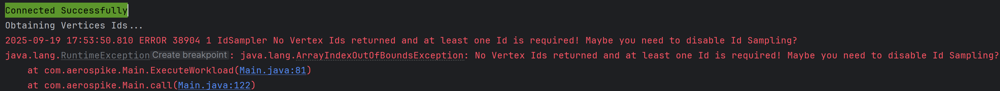

# Vertex Id Manager


## Id Sampler Manager

The "IdSampler" Id Manager obtains a collection of vertex ids. **This manager should only be used for vertex ids!**

If enabled, TinkerBench will collect a sample of vertex id up to the sample size before any query workloads are executed.

It is possible to filter vertex id's based on a label by providing this value to the `--IdSampleLabel` argument. Once provided, only those id are selected. You can provide multiple labels by adding multiple argument value pairs (e.g., `-label mmLabel1 -label myLabel2`or `-label myLabel1,myLabel2` )

Once collected each executing query can receive a random id from this collection based on the presents of the vertex id placeholder.

### Default Gremlin Query used to obtain Vertex Ids

If `--label` is provided, the following query is used to obtain the ids:

```groovy
g.V()
    .hasLabel(label)
    .id()
    .limit(sampleSize)
    .toList();
```

If a label is not provided (default), the following query is used to obtain the ids:

```groovy
g.V()
    .limit(sampleSize)
    .id()
    .toList()
```

### Using a Gremlin Query String

When using a Gremlin query string, you can use the "%s" placeholder in the query string. If the id value is a string, quotes are automatically added to ensure proper query syntax. If the Id value must be a string, quotes can be placed around the placeholder.

Note: Single or double quotes can be used in a Gremlin query string.

#### Example 1

```groovy
g.V(%s).out("REL_DEVICE_TO_INDIVIDUAL").in("REL_DEVICE_TO_INDIVIDUAL")

java tinkerbench-1.0.0-jar-with-dependencies.jar "g.V(%s).out('REL_DEVICE_TO_INDIVIDUAL').in('REL_DEVICE_TO_INDIVIDUAL')"
```

#### Example 2

Using quotes around the placeholder to ensure the id value is always a string.

```groovy
g.V("%s").out("REL_DEVICE_TO_INDIVIDUAL").in("REL_DEVICE_TO_INDIVIDUAL")

java tinkerbench-1.0.0-jar-with-dependencies.jar "g.V('%s').out('REL_DEVICE_TO_INDIVIDUAL').in('REL_DEVICE_TO_INDIVIDUAL')"
```

#### Example 3 with Label

Using a label value of "airport" to obtain the collection of vertexes.

```groovy
g.V("%s").out("REL_DEVICE_TO_INDIVIDUAL").in("REL_DEVICE_TO_INDIVIDUAL")

java tinkerbench-1.0.0-jar-with-dependencies.jar "g.V('%s').out('REL_DEVICE_TO_INDIVIDUAL').in('REL_DEVICE_TO_INDIVIDUAL')" -label airport
```

#### Example 4 without using a Random Vertex Id (Id disabled)

```groovy
g.V(2070).out("REL_DEVICE_TO_INDIVIDUAL").in("REL_DEVICE_TO_INDIVIDUAL")

java tinkerbench-1.0.0-jar-with-dependencies.jar "g.V(2070).out('REL_DEVICE_TO_INDIVIDUAL').in('REL_DEVICE_TO_INDIVIDUAL')" --IdSampleSize 0
```

### Using a Predefined Query

When using a [Predefined Query](./writing_predefined_queries.md), you can use the **getVId** method in the Gremlin query. Method **getVId** can return null if Vertex Id Manager is disabled.

#### Example 1

```groovy
G().V( getVId() )
    .out()
    .limit(5)
    .path()
    .by(values("code","city")
            .fold())
    .toList();

java tinkerbench-1.0.0-jar-with-dependencies.jar AirRoutesQuery1
```

### Errors

If the Vertex Id manager is enabled and no ids are retreived the following error is thrown:



### Importing Vertex CSV File

TinkerBench can import a vertex CSV file to be used as the vertex ids for the workload.

If `--label` or `--IdSampleSize` arguments are provided, the number of ids imported will be based on the sample size argument. If a label is provided, only those ids associated with the label are imported.

The path argument can be one of the following:

- A path with wildcards
- A directory where any `*.csv` files within that folder will be imported.
- A file path with a file name and extension

#### Import Command Line

```bash
java tinkerbench-*.jar AirRoutesQuery1 --ImportIds ./savedids.csv

java tinkerbench-*.jar AirRoutesQuery1 --ImportIds ./*.csv

java tinkerbench-*.jar AirRoutesQuery1 --ImportIds ../myfolder/
```

#### Vertex CSV File Format

The file must have the following header:

```
-id
```

or

```
-id,-label
```

Where "-id" is the vertex id. The optional "-label" column can include the associated label.

##### Example

```csv
-id
342
1464
728
635
3294
3235
2988
2688
3277
```

##### Example with Labels

```csv
-id,-label
342,airport
1464,airport
728,
635,city
3294,city
3235,airport
2988,city
2688,
3277,airport
```

When the optional "label" column is defined and the id doesn't have an associated label, the id must be terminated by a comma.

|  | Additional columns can be provided. These additional columns will be ignored. |
|------------------------------------|-------------------------------------------------------------------------------|

### Exporting Vertexes to a File

Vertex Ids that have been imported by wither the import command or the Id Device Manager can be expoerted using the `--ExportIds` aegument.

This will export all imported ids.

The value to `--ExportIds` should be a valid file path with file name and extension. If the path doens't exists it will be created. If the file exist, it will be overwritten without warning.

#### Export Command Line

```bash
java tinkerbench-*.jar AirRoutesQuery1 --ExportIds ./savedids.csv
```

## Id Chain Sampler

This manager can be used to obtain ids (vertex, edges, etc.) or property values that can be used within a gremlin string. The ids/values returned can be associated with each other to form a chain or tree structure. Below is an example based on Ids at a maximum depth of four:

```text
Id 1
├── Id 1364
│ ├── Id 18
│ │ ├── Id 182
│ │ └── Id 144
│ └── Id 11
└── Id 147
├── Id 103
└── Id 1237
Id 2
├── Id 2364
│ ├── Id 28
│ │ ├── Id 282
│ │ └── Id 244
│ └── Id 21
└── Id 247
├── Id 203
└── Id 237
```

### Understanding Random Id/Value Selection

Using a Id/value within a Gremlin query string is based on the top-level depth. Using the above example:

- Level 1 – Id 1, Id 2
- Level 2 – Id 1364, Id 147, Id 103, Id 2364, 247
- Level 3 – Id 18, Id 182, Id 28, Id 21

Once an Id/value at a certain level is randomly selected, all downstream selections (children) will always be related to its “parent” selection.

If “Id 2” is selected and Gremlin query request a depth of 4. Below is an example of the possible selections:

- Level 2 - 2364, 247, 203, or 237 are possibilities
- Id 2364 is selected -\> Level 3 – 28 or 21 are possibilities
- Id 28 is selected -\> Level 4 – 282 or 284 are possibilities
- Id 247 is selected -\> Level 3 has no possibilities (null is returned)

### Populating Ids/Values

Yo can populate the Manager by means of a CSV file or a Gremlin query.

#### Using a Gremlin Query

You can write a custom Gremlin query to obtain the ids/values and any depth required for your testing query. Once the query is written and tested you can use the “—IdGremlinQuery” argument to define the query to this Manager.

The Gremlin query must return one of three possible result formats.

##### One - List Format

```json
[ [
    { "path": [1, 1364, 18]},
    { "path": [1, 1364, 11]},
    { "path": [1, 1364, 18, 182]},
    { "path": [1, 1364, 18, 144]},
    { "path": [1, 147, 1103]},
    { "path": [1, 147, 1237]},
 ], [
    { "path": [2, 2364, 28]},
    { "path": [2, 2364, 21]},
    { "path": [2, 2364, 28, 282]},
    { "path": [2, 2364, 28, 244]},
    { "path": [2, 247, 203]},
    { "path": [2, 247, 237]}
] ]
```

This result set should contain the parent value (e.g., 1,2) and its associated children.

Below is an example based on the “Air Routes” dataset.

###### Corresponding List Format Gremlin Query

```groovy
g.V(1,2).
  out('route').
  local(
    repeat(out('route').
            simplePath()).
    emit().
    times(2). //limits how deep the traversal goes (1 = direct children, 2 = grandchildren, etc.). minus 1
    path().
    by(id()).
    fold()
  ).toList()
```

##### Two - Paths Property Format

This format should be used if there are circular references in the dataset back to the top-level parent (e.g., 1->1364->18->182->1)

```json
[ {
    "startid": 1,
    "paths": [
        { "path": [1, 1364, 18]},
        { "path": [1, 1364, 11]},
        { "path": [1, 1364, 18, 182]},
        { "path": [1, 1364, 18, 144]},
        { "path": [1, 147, 1103]},
        { "path": [1, 147, 1237]},
    ]},
    {
    "startid": 2,
    "paths": [
        { "path": [2, 2364, 28]},
        { "path": [2, 2364, 21]},
        { "path": [2, 2364, 28, 282]},
        { "path": [2, 2364, 28, 244]},
        { "path": [2, 247, 203]},
        { "path": [2, 247, 237]}
    ]}
]
```

This result set should contain the parent value (e.g., 1,2) and its associated children.

Below is an example based on the “Air Routes” dataset.

###### Corresponding Paths Property Gremlin Query

```groovy
g.V(1,2).
  as('start').
  repeat(
    out('route').simplePath()
  ).
  emit(
    not(out('route')).
    or().
    loops().is(3)
  ).
  times(3). //Depth of traversal of children
  path().by(id).as('p').
  select('start','p').
    by(id).
    by().
  group().
    by('start').   // group by startId
    by('p').       // collect paths per startId
  unfold().
  project('startId', 'paths').
    by(keys).
    by(values).
  toList()
```

##### Three - Path Property Format

This format should be used if there are circular references in the dataset back to the top-level parent (e.g., 1->1364->18->182->1)

```json
[
  ["startid": 1,
    "path": [1, 1364, 18]],
  ["startid": 1,
    "path": [1, 1364, 11]]
  ["startid": 1,
    "path": [1, 1364, 18, 182]],
  ["startid": 1,
      "path": [1, 1364, 18, 144]],
  ["startid": 1,
      "path": [1, 147, 1103]],
  ["startid": 1,
      "path": [1, 147, 1237]],
    ["startid": 2,
    "path": [2, 2364, 28]],
  ["startid": 2,
      "path": [2, 2364, 21]],
  ["startid": 2,
      "path": [2, 2364, 28, 282]],
  ["startid": 2,
      "path": [2, 2364, 28, 244]],
  ["startid": 2,
      "path": [2, 247, 203]],
  ["startid": 2,
      "path": [2, 247, 237]]
]
```

This result set should contain the parent value (e.g., 1,2) and its associated children.

Below is an example based on the “Air Routes” dataset.

###### Corresponding Path Property Gremlin Query

Note: This Example returns property values as possible values.

```groovy
g.V()
  .has('code', 'ORD')
  .as('s')
  .out('route')
  .out('route')
  .out('route')
  .has('code', 'SFO')
  .project('startid', 'path')
  .by(select('s')
      .values('code'))
      .by(path()
      .by('code'))
  .toList()
```

Result of the above query:

```json
[
  ["startid":"ORD",
    "path":["ORD","GSO","MIA","SFO"]]
  ["startid":"ORD",
    "path":["ORD","GSO","PHL","SFO"]]
  ["startid":"ORD",
    "path":["ORD","GSO","ORD","SFO"]]
  ["startid":"ORD",
    "path":["ORD","GSO","DTW","SFO"]]
  ["startid":"ORD",
    "path":["ORD","GSO","CLT","SFO"]]
  ["startid":"ORD",
    "path":["ORD","GSO","ATL","SFO"]]
  ["startid":"ORD",
    "path":["ORD","GSO","TPA","SFO"]]
  ["startid":"ORD",
    "path":["ORD","GSO","DCA","SFO"]]
  ["startid":"ORD",
    "path":["ORD","GSO","DEN","SFO"]]
]
```

##### Command Line Example (Gremlin)

```bash
java tinkerbench-*.jar 'g.V(%1$s).
  repeat(out().simplePath()).
  until(hasId(%2$s)).
  path()' --IdManager com.aerospike.idmanager.IdChainSampler --IdGremlinQuery 'g.V(1,2).out("route").local(repeat(out("route").simplePa()).emit().times(2).path().by(id()).fold())'
```

#### Using a CSV File

The Manager can also import the data using a CSV file. Header and comment lines are ignored.

Top-level parents must be deffined as a single one line entry. A single line can define all the relarionships of a parent or they can be defined on different lines.

##### Example Multi-Line

```text
1
2
1,1364,18
1364,18
18,182
18,144
1,1364,11
1,147,1103
1,147,1237
2,2364,
2364,28
28,282
28,244
2,2364,21
2,247,203
2,247,237
```

##### Example Single-Line

```text
1
2
1,1364,18,182
18,144
1,1364,11
1,147,1103
1,147,1237
2,2364,
2364,28,282
28,244
2,2364,21
2,247,203
2,247,237
```

#### Import Command Line Id Chaining

```bash
java tinkerbench-*.jar 'g.V(%1$s).
  repeat(out().simplePath()).
  until(hasId(%2$s)).
  path()' --IdManager com.aerospike.idmanager.IdChainSampler --ImportIds ./savedchainids.csv

java tinkerbench-*.jar 'g.V(%1$s).
  repeat(out().simplePath()).
  until(hasId(%2$s)).
  path()' --IdManager com.aerospike.idmanager.IdChainSampler --ImportIds ./*.csv

java tinkerbench-*.jar 'g.V(%1$s).
  repeat(out().simplePath()).
  until(hasId(%2$s)).
  path()' --IdManager com.aerospike.idmanager.IdChainSampler --ImportIds ../myfolder/
```

### Embedding the Placeholders within a Gremlin String

To embed a id/value within a Gremlin string, use the [Java advance string format syntax](https://docs.oracle.com/en/java/javase/21/docs/api/java.base/java/util/Formatter.html).

The id/value placeholder has the following syntax:

```text
%[-]<depth>$s
```

Where "depth" is the numeric depth level to obtain the id/value. An depth value of 1 is a parent node (root) and greater depth values are children under the selected parent ( 2 - child, 3 - grandchild, etc.).

If the "depth" is negitive the depth starts from the leaf child (bottom node) and move up the tree. A value of -1 is the most bottom child of the parent (-2 second from the bottom, etc.). If the negitive depth is greater than the tree depth (e.g., -100 but the dept is only 10), the parent is always selected.

If your depth is ducplicated in a query (e.g., `g.V(%1$s, %1$s)`), it will alway reference the same node. In this case, the `%1$s` will be the same parent.

Below are some examples:

```groove
g.V(%1$s).
  repeat(out().simplePath()).
  until(hasId(%2$s)).
  path()
```

What this query does:

- g.V(%1$s) — start at airport top=levelparent (depth 1)
- repeat(out().simplePath()) — traverse outgoing edges (routes)
- until(hasId(%2$s)) — stop with child (depth 2) vertex reached
- path() — return the full route

```groove
g.V(%1$s).
  repeat(out()).
    until(hasId(%3$s)).
    times(8).
  path()
```

What this query does:

- g.V(%1$s) — start at airport top=levelparent (depth 1)
- repeat(out()) — traverse outgoing edges (routes)
- until(hasId(%3$s)) — stop when grandchild (depth 3) vertex reached
- times(8) — allow up to 8 hops
- path() — return the full route

Using the Air routes dataset and a Gremlin Query that loads "aireport codes" into the Id Manager (see below):

```groovy
g.V().has('airport', 'code', %1$s).as('p1').
  out('route').inV().has('airport', 'code', %2$s).as('p2').
  out('route').inV().has('airport', 'code', %4$s).as('p4').
  path().by('code')
```

Where:

- '%1$s' will select an airport (parent)
- '%2$s' will select a valid child airport assocated to the parent.
- '%4$s' will select a great-grandchild airport releated to the child airport.

### Exporting Ids/Values to a File (Id Chaining)

Exporting to a file works the same way as outlined in [Sample Id](#exporting-vertexes-to-a-file).

## Writing a Custom Vertex Id Manager

TinkerBench supports the use of custom Vertex Id Manager by extending the current manager or writing a new manager.

To create a new Id Manger, the new manager must extend from the “`IdManager”` interface and must be defined in the “com.aerospike.idmanager” namespace.

Custom Vertex Id Manager can be extended/created by means of the TinkerBench Predefine Jar file. For more information, see [Writing Predefined Queries](./writing_predefined_queries.md) section.
