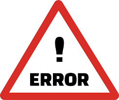
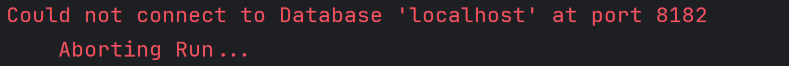

# Understanding Errors

If an error or exception is encountered, TinkerBench will determine if can proceed with execution of the query. If the error is fatal (e.g., cannot connect to the database, query syntax error, etc.), TinkerBench will terminate, and it may or may not produce a [summary report](./understanding_output.md#stage-6-report-result).

The error will always be reported to the console typically in an abbreviated format.

If an error occurs during query execution and is not fatal, TinkerBench will continue Query execution until the error trigger limit is reached defined by `--Errors` argument. Once the error limit is reached, TinkerBench will terminate all queries and execution. A [summary report](./understanding_output.md#stage-6-report-result) is produced.

## Obtaining Error Details

To obtain error details including stack traces, nested exceptions, etc., logging must be enabled. See the [Logging](./understanding_output.md#logging) section for more information.
