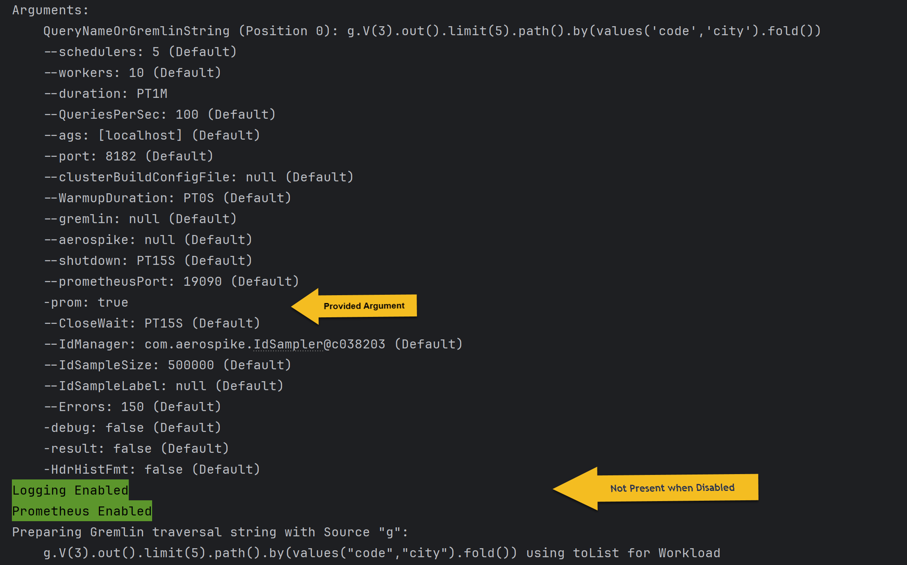
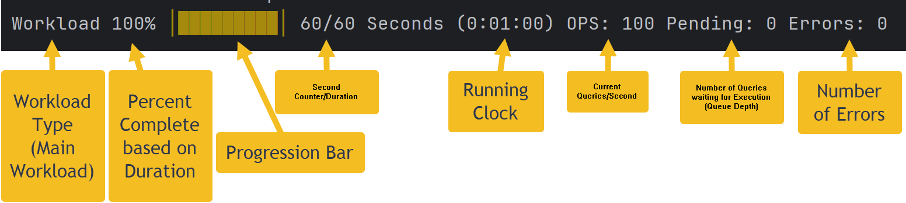
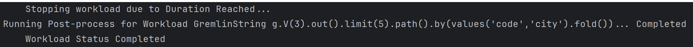

**TinkerBench** is a benchmarking tool designed Graph databases based on [Apache TinkerPop](https://tinkerpop.apache.org/). It provides an efficient way to measure [Gremlin Query](https://docs.janusgraph.org/getting-started/gremlin/) performance in an easy and flexible manner.

# Overview

**TinkerBench** provides all the necessary performance metrics of the query. It provides latency, rate, count, and error information. This information is delivered in real time on the console or within a [Granfa dashboard](https://grafana.com/grafana/dashboards/). Information can be captured in a log file for post-processing or historical reference.

**TinkerBench** has two different ways to provide the Gremlin Query for analysis.

-   As a query String -- Pass the actual query string by means of the command line for execution. The query is compiled and that result is used for measurement. Static or random vertex identifiers can be used in the query.
-   Java Jar – Provide a [Java Jar](https://docs.oracle.com/javase/8/docs/technotes/guides/jar/jarGuide.html) file using the **TinkerBench** framework. With this method, you can pass the name of the custom query class by means of the command line for execution. This method provides an advanced way to handle complex configurations, complex queries, vertex/edge management, etc. The framework handles mundane things like measurements, error handling, logging, user interface, etc. The developer only needs to focus on the desired query behavior.

# Understanding the Command Line Interface (CLI)

To obtain the command-line arguments with description and examples run TinkerBench with the “—help” flag. If an argument is not valid, an error message is displayed providing feedback so that a proper value is supplied.

|  | Arguments can be passed in as a [Java property file](https://localizely.com/java-properties-file/) instead of the command line. If a property file is provided, you can override the file’s property values by means of the command line. For more information, see \<property file\> section. |
|------------------------------------------------------------------------------------------------------|------------------------------------------------------------------------------------------------------------------------------------------------------------------------------------------------------------------------------------------------------------------------------------------------|

Below are the arguments and description:

-   QueryNameOrGremlinString (String, Required) – This is a required argument that can be located as the first or last argument in the command line. There are three value forms this argument can take. They are:
    -   A Gremlin query string. This string will be compiled and executed for analysis. **Examples**:
        -   `g.V(3).out().limit(5).path().by(values('code','city').fold()).tolist()`
        -   `g.V(%s).out().limit(5).path().by(values('code','city').fold()).tolist()` Where ‘%s’ will be substituted with a random vertex id from the vertex manager. For more information see \<vertex manager\>.
    -   A Predefined Query. A query defined using the TinkerBench framework. For more information see \<predefine reference\>.
    -   The keyword ‘List’. If provided all other arguments are ignored. This will list all the predefined queries found in the [Java class path](https://en.wikipedia.org/wiki/Classpath). For more information see \<predefine reference\>.
-   \--ags, -a (String, Default localhost) – One or more graph nodes’ IP address or host name. To provide multiple nodes, each node must be paired with this argument. **Examples**:
    -   `–ags myGraphNodeName`
    -   `-ags 10.1.1.1123`
    -   `-a 10.1.1.1123 -a 10.1.1.1124 -a 10.1.1.1125` Providing multiple graph node addresses
-   \--port (Integer, Default 8182) – Graph node’s connection port number.
-   \--QueriesPerSec, -q (Integer, Default 100) -- The targeted number of queries per seconds. TinkerBench will try to achieve and maintain this target for the query duration based on the scheduler and worker arguments. See \<tuning\> for additional information.
-   \--duration, -d (Time, Default 15 minutes) -- The time duration the query is executed for analysis. This would be the main workload for complete analysis. This duration should be long enough for TinkerBench to achieve its’ targeted query rate. The value can take multiple forms. They are:
    -   [ISO 8601](https://docs.oracle.com/javase/8/docs/api/java/time/format/DateTimeFormatter.html) format **Example**: PT1H2M3.5S – one hour, 2 minutes and 3.5 seconds
    -   A number (integer) of seconds **Example**: 45 – 45 seconds
    -   xHour(s)\|Hr(s)\|HyMinute(s)\|Min(s)\|MzSecond(s)\|Sec(s)\|S – Where x, y, and z are integers. The unit of time (H, M, S, Hour, etc.) are case insensitive. **Example**:
        -   1h30s – one hour and 30 seconds
        -   2hrs45seconds – two hours and 45 seconds
        -   3hours5mins30s – three hours, 5 minutes, and 30 seconds
-   \--WarmupDuration, -wu (Time, Default disabled) – The query “warmup” duration. The warmup is run using the same graph connection that will be used by the main query workload. The warmup helps the graph database to optimize the query and aids TinkerBench in achieving the targeted rate during the main workload analysis. This takes the same value format as the “duration” argument above. A value of zero (0) will disabled the warmup which is the default.
-   \--schedulers, -s (Integer, Default depends on cores) – Schedulers are used to manage workers to control the query rate. The default number of schedules is based on the quarter of the number of cores of the machine TinkerBench is currently executing on. A value of -1 will indicate to use the default value. For more information, see the \<tuning\> section. **Example**: 20 core machine -\> there will be 4 schedulers.
-   \--workers, -w (Integer, Default depends on cores) -- The number of workers per scheduler. A worker is responsible for executing a single query instance and collecting data from that instance for analysis. The default number of workers is based on half of the number of cores of the machine TinkerBench is currently executing on. A value of -1 will indicate to use the default value. For more information, see the \<tuning\> section. **Example**: 20 core machine -\> there will be 10 workers per scheduler (total of 40 workers over 4 schedulers).
-   \--IdSampleSize, -sample (Integer, Default 500,000) – The number of vertex ids that will be retrieved from the database that will be used as a vertex id by the query, if required. If the query doesn’t use a random vertex id, this feature is disabled. See argument “*—IdSampleLabel*” for additional information. For more information, see \<vertex manager\>.
-   \--IdSampleLabel, -label (String, Default is None) – If provided, this is a label that is used in retrieving the vertex ids from the database. These ids, if required by the query, are used by the query as a random vertex id to the query. If the See argument *“—IdSampleSize*” for additional information. For more information, see \<vertex manager\>.
-   \-prom (Flag) – If provided, enables the [Prometheus](https://prometheus.io/) exporter which provides near real-time metrics of the running TinkerBench application in TinkerBench [Grafana](https://grafana.com/grafana/dashboards/) dashboard. For more information, see \<prom\> section.
-   \-HdrHistFmt -- If provided, the summary console output upon exit of the TinkerBench application will provide an [HdrHistogram](https://github.com/HdrHistogram) Latency table. This table can be used by the [HdrHistogram plotter](https://hdrhistogram.github.io/HdrHistogram/plotFiles.html). If not provided a “Summary latency” is provided. For more information, see \<output\> section.
    **Note**: The HdrHistogram table is always provided in the log file, if logging is enabled.
-   \--Errors, -e (Integer, Default 150) – The total number of error occurrences that will cause TinkerBench to shutdown query analysis and display the console summary.
-   \--version, -V – Prints the TinkerBench and Gremlin client version information.

### Advance or Rarely Used Arguments

-   \--aerospike, -as (Key/Value Pair) – One or more [Aerospike graph traversal configuration options](https://aerospike.com/docs/graph/reference/config/) as a key/value pair (OptionName=OptionValue). This argument can only be used for Aerospike options (not Gremlin options, see “—gremlin” argument). You are not required to include the “aerospike” prefix before the option name. For each option, you need to provide this argument. **Examples**:
    -   `-as graph.parallelize=10 -as client.policy.maxRetries=2` Provides the aerospike.graph.parallelize and aerospike.client.policy.maxRetries configuration for this run
    -   `-as aerospike.graph-service.gremlinPool=4`
-   \--clusterBuildConfigFile, -b (File Path) – [Gremlin cluster builder configuration](https://www.gremlin.com/docs/getting-started-agent-configuration) file.
-   \--gremlin, -g (Key/Value Pair) – One or more Gremlin traversal source configuration options (i.e., [step modulator](https://tinkerpop.apache.org/docs/current/tutorials/gremlins-anatomy/)) as a key/value pair (OptionName=OptionValue). **Example**:
    -   `-g evaluationTimeout=30000 -g paging=2` This will update the traversal with an “evaluation time” of 30 seconds and a “paging” value of 2
-   \--shutdown, -sd (Time, Default 15 seconds) -- Additional time to wait after workload completion (normal or aborted) to allow for proper cleanup. Typically, the default provides enough time for cleanup.
-   \--prometheusPort (Integer, Default 19090) – The endpoint port used by [Prometheus](https://prometheus.io/docs/prometheus/latest/configuration/configuration/) to obtain the metrics used by the Granfa dashboard.
-   \--CloseWait (Time, Default 5 seconds) – The wait interval used upon application exit to ensure Prometheus has obtained all the required information. This value should match or exceed the ['scrape interval](https://prometheus.io/docs/prometheus/latest/configuration/configuration/)' in the Prometheus ymal file. This argument is ignored, if Prometheus is disabled (*-no-prom*).
    **Note**: It is recommended that the scrape interval for the Prometheus TinkerBench job be set to 5 seconds.
-   \-result (Flag) -- Enables the results of **every** Gremlin query execution to be displayed and logged. Should only be used for debugging purposes.
-   \-debug (Flag) -- Enables application debugging tracing and “DEBUG” logging. Should only be used for debugging purposes.

# Understanding Workload and Runtime Stages

TikerBench2 has two workload run types. They are:

-   Warmup – Conducted if the warmup duration *(--WarmupDuration*) is defined. This executes the query like “workload” for the purpose of “warming up” the database. Meeting the targeted QPS rate may or may not occur. Summary results are captured and reported. This run is not required.
-   Workload – This preforms the “**main”** workload and strides to make and maintain the QPS rate for the duration of the run. Results are captured and reported based on the configuration provided.

When TinkerBench2 executes it goes through the following stages:

1.  Initialization
    Performs checks of the configurations, prepares and connections to the database, etc.
2.  Vertex Id retrieval, if required
    Obtains vertex ids, if required by the query. These ids are randomly selected for each execution of the query.
3.  Preparing and Completion of the Gremlin Query String, if required
    If a Gremlin query string is provided, the string is prepared and compiled into bytecode for repeated executing during workload run phase.
4.  Workload Run Phase (i.e., run Warmup and/or Main Workload)
    For each workload run type the following phases are executed:
    -   Preprocessing
        The workload scheduler is prepared to execute the query
    -   Start
    -   Iteration
        This phase is run until the duration is obtains. The scheduler adjusts the workers to obtain the QPS rate based on the provided configuration.
    -   Postprocessing
        This phase performs result collection, cleanup, etc.
    -   Shutdown
5.  TinkerBench2 Cleanup
6.  Report Results
    This stage will display the results based on the configuration provided.

# Understanding Output

TinkerBench2 produces three types of artifacts. They are:

-   Console
-   Logging
-   Grafana Dashboard

## Console

Console output is always produced.

### Stages 1 to 3

Below shows the normal output produced for stages 1 to 3 of a run.
This output shows the arguments provided and the default values. If [Prometheus](https://prometheus.io/) is enabled (enabled in this example) and/or Logging is enabled (enabled in this example). If Prometheus and/or Logging was disabled, no output would be present.

### Stage 4 (Workload Run Phase)

The console will display the pre and post phases plus a “ticker” showing query iteration progression.

This ticker shows the following runtime information:

-   Workload Type -- Warmup or Workload (Main)
-   Percent completed based on the query duration
-   Ticking progression bar
-   The number of seconds elapsed and the provided duration
-   Running clock
-   Current Query Per Second
-   Pending number of queries waiting for execution (Queue Depth). For more information see \<tuning\> section.
-   Number of encountered errors

### Stage 5 (Postprocessing/Cleanup)

The console will typically show the following output.

Note that there could be different reasons why the workload was stopped (terminated). They are:

-   Duration Reached – The workload duration was reached, stopping the execution normally.
-   Due to Signaled – TinkerBench2 was interrupted by a kill, Ctrl-C, etc.
-   Due to Error – The maximum number of errors was reached resulting in termination.
-   Due to Timeout – Query execution progression was not being made based on the Gremlin timeout and execution was terminated.

In any abnormal termination, Stage 6 (Report Results) will always be run providing any results up to the termination.

### Stage 6 (Report Result)
