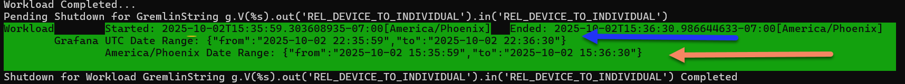

# Grafana Dashboard


## Get started with Grafana and Prometheus

Before being to use the TinkerBench2's Grafana Dashboard, you need to setup the environment. Instructions can be found [here](https://grafana.com/docs/grafana/latest/getting-started/get-started-grafana-prometheus/#get-started-with-grafana-and-prometheus).

## Downloading and Installing the TinkerBench2's Dashboard

Once Grafana and Prometheus is running, download the [TinkerBench2 Dashboard](../Aerospike%20Tinker%20Bench%202.json).

Once downloaded, follow these [instructions to import into Grafana](https://grafana.com/docs/grafana/latest/dashboards/build-dashboards/import-dashboards/).

## Configuring Prometheus to Scrap TinkerBench2

Once the above steps are completed, it is time to [configure Prometheus](https://prometheus.io/docs/prometheus/latest/configuration/configuration/) to connect to TinkerBench2.

The default defined port for TinkerBench2 is 19090. This can be changed by the "[--prometheusPort](./understanding_command_line_interface.md)" argument.

Below is an example of a "prometheus.yml" file configured for TinkerBench2 and Aerospike Graph.

```yml
# global config
global:
  scrape_interval: 15s # Set the scrape interval to every 15 seconds. Default is every 1 minute.
  evaluation_interval: 15s # Evaluate rules every 15 seconds. The default is every 1 minute.
  # scrape_timeout is set to the global default (10s).

# A scrape configuration containing exactly one endpoint to scrape:
# Here it's Prometheus itself.
scrape_configs:
  # The job name is added as a label `job=<job_name>` to any timeseries scraped from this config.

  - job_name: TinkerBench2
    #honor_timestamps: true
    #scrape_interval: 5s
    #scrape_timeout: 10s
    metrics_path: /metrics
    static_configs:
    - targets:
      - localhost:19090

  - job_name: AGS
    #honor_timestamps: true
    #scrape_interval: 5s
    #scrape_timeout: 10s
    metrics_path: /metrics
    scheme: http
    static_configs:
    - targets:
      - localhost:29090
```

## Dashboard


1. These set of dropdowns are used to filter the panels/results. You can select TinkerBench2's client(s), Workloads, and stages.
2. The timeframe of the results.
3. The Predefined Query or the complete Gremlin Query string
4. The starting/ending timestamp of the workload and the total workload duration
5. The TinkerBench2' command line arguments
6. TinkerBench2's basic configuration
7. Id Manager's basic configuration including the actual number of Vertices retrieved
8. Warmup workload information, like the current stage, completed query count, errors, running time, average QPS based on last updated time, **overall average** latency (see note below)
9. Query Workload information (see number 8 above)
10. Query per Second chart based on Prometheus scrap interval.
**Warning**:  For an accurate QPS, please review the reports produced in the logs or displayed on the console. This information only provides an estimated QPS.
11. Query Depth Queue that provides an estimated based on the Prometheus scrap interval. See [Tuning section](./tuning.md) for more information.
12. A list of errors and an overview summary of the error with the number of occurrences.
**Note** that if you hoover the mouse over the error text, additional information is displayed.
13. The number of errors over time.

|  | For the most accurate QPS and Latency, refer to the [console](./understanding_output.md#understanding-output) reports and [log](./understanding_output.md#logging) reports. The dashboard is based on averages over the scraping rates. |
|------------------------------------------------------------------------------------------------------|----------------------------------------------------------------------------------------------------------------------------------------------------------------------------------------------------------------------------------------------------------------------------------------------------------------------------------|

## Using the Grafana Timestamps

On console output (and in the logs), there will be a Grafana Json Timestamp outputted. This timestamp will provided the starting and ending time of a warmup/workload phase and an application starting/ending timestamp.

This [timestamp can be pasted into any Grafana dashboard](https://grafana.com/whats-new/2024-01-28-copy-and-paste-time-range/). This will reposition the dashboard to that timestamp range.

### Workload Phase Timestamp

Below is a warmup/workload phase display:



The bluse arrow points to the Grafana Timestamp as UTC.

The yellow arrow points to your local timezone timestamp.

Either can work in Grafana but you are required to change the timezone.

### Application Timestamp

Below is an application timestamp display:

