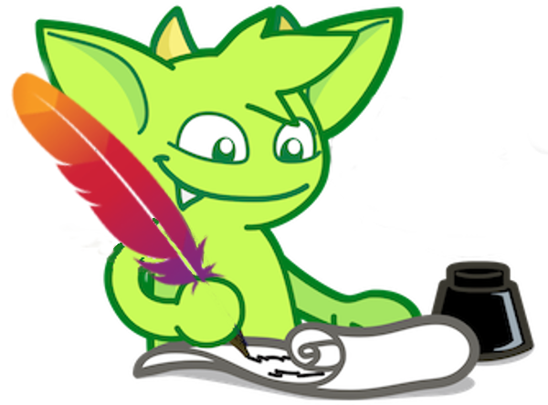

# Tuning TinkerBench2 Queries per Second

This section will review how to interpret TinkerBench2's output to optimize the scheduler and worker parameters. Tuning and optimizing of the [Tinkerpop](https://tinkerpop.apache.org/docs/current/reference/?utm_source=chatgpt.com) Client Driver, [JVM](https://javanexus.com/blog/boosting-java-performance-jdk-21-tips?utm_source=chatgpt.com), or [Gremline queries](https://github.com/tinkerpop/gremlin/wiki/Traversal-Optimization/2210259a510dca8183a69c76c8d11ccaf6e1c529?utm_source=chatgpt.com) is not within the scope of this document.

If TinkerBench2 is struggling to maintain or acheive the desired rate (QPS) adjustments to the number of schedulers and workers will typically resolve this issue without any need to adjust the JVM or Tinkerpop's client driver parameters.

## Understanding Output

TinkerBench2 provides a Query Depth metric. This metric shows how many pending queries are waiting for execution (queue depth).

This queue depth can be observed during execution and a summary report is produced upon workload completion.

TinkerBench2 produces three different outputs. They are:

- [Console](./understanding_output.md)
- [Log File](./understanding_output.md#logging)
- [Grafana Dashboard](./grafana_dashboard.md)

### Console and Log

#### Progression Bar (Only Console)

During a workload execution the progression bar provides an 1-second snapshot of the QPS and queue depth (pending label):

This information can be observed during execution to provides an overview of the current performance of TinkerBench2.

#### Query Depth Summary Report (Console and Log)

A Summary Query Depth report is produced upon completion of the workload.

Below is an example:

The Query Depth Report provides the following information:

- The average query depth, in this example is three.
- The maximum number of pending queries reached in the queue.
- The "occurrence rate" (e.g., 0.43%), indicates the percentage of the total maximum depth occurrences compared to the total queries executed in this workload.
  - For example, if the total number of queries executed by the workload is 6,000 and the "occurrence rate" is 0.43%. The number of times the maximum depth was hit was ~26 times.
- "25% depth" -- Depth was at or below 25% the total maximum depth occurrences (distribution of the pending queries).
- "50% depth" -- Depth was at or below 50% of the total maximum depth occurrences. This includes depth under 25%.
- "75% depth" -- Depth was at or below 75% of the total maximum depth occurrences. This includes depth under 25% and 50%.
- "90% depth" -- Depth was at or below 90% of the total maximum depth occurrences. This includes depth under 25%, 50%, and 75%.

These percentiles help to determine the efficiency of TinkerBench2's QPS maintenance.

#### Maintaining QPS without Errors

Below is an example of a normal workload execution. Note the low occurrence rate even though the depth reached 31, no errors, and targeted QPS.

##### Under QPS without Errors

If TinkerBench2 is not maintaining the QPS; try increasing the number of worker by 25%, if the QPS is reached above 90% of the targeted QPS.

In the above example, the targeted QPS was 3K but we only obtained 2.8K QPS (94.98%). In this case, multiple the current number of workers (e.g., 20) by 25% which results in trying 25 workers for the next run.

If the QPS is below 90% of the targeted QPS, and the "occurrence rate" is above 50%, increase the number of workers by the "occurrence rate".

In the above example, the targeted QPS was 4K but we only obtained 3.2K QPS (79.84%). In this case, multiple the current number of workers (e.g., 40) by 99% (occurrence rate) which results in trying 79 workers for the next run.

If you apply the above formula and the updated number of workers (e.g., 79 workers) resulted in a very similar QPS percent difference and "occurrence rate" between the runs without any errors.

This behavior suggests that either the TinkerBench2 node, the AGS node(s), and/or the Aerospike database cluster may have resouce issues (e.g., CPU, network, memeory, etc).

|  | Typically increasing the number of schedulers will not acheive the target QPS. It is suggested that TinkerBench2 use the calculated number of schedulers. |
|------------------------------------------------------------------------------------------------------|----------------------------------------------------------------------------------------------------------------------------------------------------------------------------------------------------------------------------------------------------------------------------------------------------------------------------------|

##### Maintaining QPS with Errors

TinkerBench2 can maintain the targeted QPS even if errors are occurring. If an error occurs during the execution of a query, that query's latency is not recorded.

### Grafana Dashboard

If the "[--prometheus](understanding_command_line_interface.md)" switch is enabled, the Query Depth can be monitored using the TinkerBench2 Grafana [dashboard](grafana_dashboard.md).

The "Client Queue Depth" panel displays the depth at based on the [Prometheus scrape interval](https://prometheus.io/docs/prometheus/latest/configuration/configuration/).

Below is an example of this panel:

Below is the corresponding console report.

Note the difference between the console report and the Grafana panel. The Prometheus scrape interval was set to 15 seconds on a 1 minute run. As such, the panel's granularity is poor. The console's report is based on real time captures.

|  | Console and log reports are always the most accurate source of information and any observations should be made on these reports. The Grafana dashboard is an overview of the progress of the workload. |
|------------------------------------------------------------------------------------------------------|----------------------------------------------------------------------------------------------------------------------------------------------------------------------------------------------------------------------------------------------------------------------------------------------------------------------------------|
