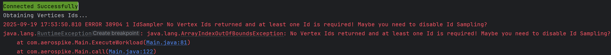

# Vertex Id Manager


The TinkerBench2 Vertex Id Manager obtains a collection of vertexes based on value provided by the `--IdSampleSize` argument (defaults to 500,000 ids). You can disable id collection by passing in a value of zero.

If enabled, TinkerBench2 will collection a sample of vertex id up to the sample size before any query workloads are executed.

It is possible to filter vertex id's based on a label by providing this value to the `--IdSampleLabel` argument. Once provided, only those id are selected.

Once collected each executing query can receive a random id from this collection based on the presents of the vertex id placeholder.

## Default Gremlin Query used to obtain the Ids

If `--label` is provided, the following query is used to obtain the ids:

```groovy
g.V()
    .hasLabel(label)
    .id()
    .limit(sampleSize)
    .toList();
```

If a label is not provided (default), the following query is used to obtain the ids:

```groovy
g.V()
    .limit(sampleSize)
    .id()
    .toList()
```

## Using a Gremlin Query String

When using a Gremlin query string, you can use the "%s" placeholder in the query string. If the id value is a string, quotes are automatically added to ensure proper query syntax. If the Id value must be a string, quotes can be placed around the placeholder.

Note: Single or double quotes can be used in a Gremlin query string.

### Example 1

```groovy
g.V(%s).out("REL_DEVICE_TO_INDIVIDUAL").in("REL_DEVICE_TO_INDIVIDUAL")
```

```bash
java tinkerbench2-2.0.15-jar-with-dependencies.jar "g.V(%s).out('REL_DEVICE_TO_INDIVIDUAL').in('REL_DEVICE_TO_INDIVIDUAL')"
```

### Example 2

Using quotes around the placeholder to ensure the id value is always a string.

```groovy
g.V("%s").out("REL_DEVICE_TO_INDIVIDUAL").in("REL_DEVICE_TO_INDIVIDUAL")
```

```bash
java tinkerbench2-2.0.15-jar-with-dependencies.jar "g.V('%s').out('REL_DEVICE_TO_INDIVIDUAL').in('REL_DEVICE_TO_INDIVIDUAL')"
```

### Example 3 with Label

Using a label value of "airport" to obtain the collection of vertexes.

```groovy
g.V("%s").out("REL_DEVICE_TO_INDIVIDUAL").in("REL_DEVICE_TO_INDIVIDUAL")
```

```bash
java tinkerbench2-2.0.15-jar-with-dependencies.jar "g.V('%s').out('REL_DEVICE_TO_INDIVIDUAL').in('REL_DEVICE_TO_INDIVIDUAL')" -label airport
```

### Example 4 without using a Random Vertex Id (Id disabled)

```groovy
g.V(2070).out("REL_DEVICE_TO_INDIVIDUAL").in("REL_DEVICE_TO_INDIVIDUAL")
```

```bash
java tinkerbench2-2.0.15-jar-with-dependencies.jar "g.V(2070).out('REL_DEVICE_TO_INDIVIDUAL').in('REL_DEVICE_TO_INDIVIDUAL')" --IdSampleSize 0
```

## Using a Predefined Query

When using a [Predefined Query](./writing_predefined_queries.md), you can use the **getVId** method in the Gremlin query. Method **getVId** can return null if Vertex Id Manager is disabled.

### Example 1

```groovy
G().V( getVId() )
    .out()
    .limit(5)
    .path()
    .by(values("code","city")
            .fold())
    .toList();
```

```bash
java tinkerbench2-2.0.15-jar-with-dependencies.jar AirRoutesQuery1
```

## Writing a Custom Vertex Id Manager

TinkerBench2 supports the use of custom Vertex Id Manager by extending the current manager or writing a new manager.

To create a new Id Manger, the new manager must extend from the `IdManager` interface.

Custom Vertex Id Manager can be extended/created by means of the TinkerBench2 Predefine Jar file. For more information, see [Writing Predefined Queries](./writing_predefined_queries.md) section.

### How to use a Custom Vertex Id Manager

To utilize a custom manager provide the class name to the `--IdManager` argument.

```bash
java tinkerbench2-2.0.15-jar-with-dependencies.jar AirRoutesQuery1 --IdManager myIdManager
```

## Errors

If the Vertex Id manager is enabled and no ids are retreived the following error is thrown:



## Importing Vertex CSV File

TinkerBench2 can import a vertex CSV file to be used as the vertex ids for the workload.

If `--label` or `--IdSampleSize` arguments are provided, the number of ids imported will be based on the sample size argument. If a label is provided, only those ids associated with the label are imported.

The path argument can be one of the following:

- A path with wildcards
- A directory where any `*.csv` files within that folder will be imported.
- A file path with a file name and extension

### Import Command Line

```bash
java tinkerbench2-2.0.15-jar-with-dependencies.jar AirRoutesQuery1 --ImportIds ./savedids.csv
```

```bash
java tinkerbench2-2.0.15-jar-with-dependencies.jar AirRoutesQuery1 --ImportIds ./*.csv
```

```bash
java tinkerbench2-2.0.15-jar-with-dependencies.jar AirRoutesQuery1 --ImportIds ../myfolder/
```

### Vertex CSV File Format

The file must have the following header:

```
-id
```
or
```
-id,-label
```
Where "-id" is the vertex id. The optional "-label" column can include the associated label.

#### Example

```
-id
342
1464
728
635
3294
3235
2988
2688
3277
```

#### Example with Labels

```
-id,-label
342,airport
1464,airport
728,
635,city
3294,city
3235,airport
2988,city
2688,
3277,airport
```

When the optional "label" column is defined and the id doesn't have an associated label, the id must be terminated by a comma.

|  | Additional columns can be provided. These additional columns will be ignored.|
|------------------------------------------------------------------------------------------------------|----------------------------------------------------------------------------------------------------------------------------------------------------------------------------------------------------------------------------------------------------------------------------------------------------------------------------------|

## Exporting Vertexes to a File

Vertex Ids that have been imported by wither the import command or the Id Device Manager can be expoerted using the `--ExportIds` aegument.

This will export all imported ids.

The value to `--ExportIds` should be a valid file path with file name and extension. If the path doens't exists it will be created. If the file exist, it will be overwritten without warning.

### Export Command Line

```bash
java tinkerbench2-2.0.15-jar-with-dependencies.jar AirRoutesQuery1 --ExportIds ./savedids.csv
```
